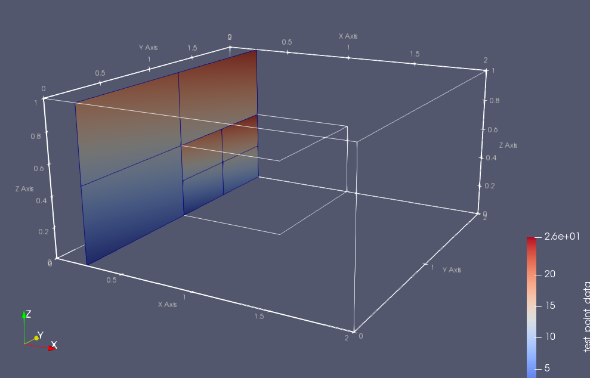

# SimpleVTK


A C++ header-only library to produce VTK format file.

SimpleVTK does not have reading functionalities for VTK, have only VTK writer,
but this library does not require heavy building and easy to use.

SimpleVTK requires knowledgement of XML based VTK format.
This library have a simple extent management system and vtkHierarchicalBoxDataSet support.

# Installation
Clone it into your project.
```bash
git clone https://github.com/hsimyu/SimpleVTK.git
```
and copy a header file "simple_xdmf.hpp" to your include directory.

Or, add it as a submodule.
```bash
git submodule add https://github.com/hsimyu/SimpleVTK.git
```

If your project already used cmake to build,
add the line below into your CMakeLists.txt.
```cmake
include_directory(SimpleVTK/include)
```
Turn ON options for cmake if you want include SimpleVTK tests and examples building.

# How To Use
```cpp
#include <simple_vtk.hpp>

int main() {
    SimpleVTK gen;

    // Some writer settings
    gen.setNewLineCodeLF();
    gen.setIndentSpaceSize(4);

    std::vector<float> values{
        0, 1, 2, 3, 4, 5, 6, 7, 8,
        9, 10, 11, 12, 13, 14, 15, 16,
        17, 18, 19, 20, 21, 22, 23
    };
    gen.beginVTK("ImageData");
        gen.beginContent();
        gen.setWholeExtent(0, 2, 0, 2, 0, 2);
        gen.setOrigin(0.0, 0.0, 0.0);
        gen.setSpacing(1.0, 1.0, 1.0);
            gen.beginPiece();
            gen.setExtent(0, 2, 0, 2, 0, 2);
                gen.beginPointData();
                gen.setScalars("potential");
                    gen.beginDataArray("potential", "Float32", "ascii");
                        gen.addVector(values);
                    gen.endDataArray();
                gen.endPointData();
            gen.endPiece();
        gen.endContent();
    gen.endVTK();
    gen.generate("generate_vtk"); // file extension will be automatically set from vtk type. (ImageData => ".vti")

    return 0;
}
```

This sample code generates
```xml
<?xml version="1.0" ?>
<VTKFile type="ImageData">
    <ImageData WholeExtent="0 2 0 2 0 2" Origin="0 0 0" Spacing="1 1 1">
        <Piece Extent="0 2 0 2 0 2">
            <PointData Scalars="potential">
                <DataArray Name="potential" type="Float32" format="ascii">
                    0 1 2 3 4 5 6 7 8 9 
                    10 11 12 13 14 15 16 17 18 19 
                    20 21 22 23
                </DataArray>
            </PointData>
        </Piece>
    </ImageData>
</VTKFile>
```

## Correct order of calling functions
SimpleVTK assumes begin/add/end structure.
When you insert a new tag, first please call a begin*() function.
After you called begin, set*() functions can set a passed argument as a attribute of the current element.
After you inserted arbitrary elements within the tag, call the corresponding end*() function.

add*() functions insert raw elements without attribute setting.
Use it to insert values into DataArray elements or empty elements.

For the vtk content (ImageData, RectlinearGrid, StructuredGrid, ...), use beginContent()/endContent() in spite of beginImageData(), beginRectlinearGrid(), ....

## Supported Functions
Supported begin/end functions are
- beginVTK(const std::string& vtk_type) / endVTK();
- beginContent() / endContent();
- beginPiece() / endPiece();
- beginPointData() / endPointData() / addPointData();
- beginCellData() / endCellData() / addCellData();
- beginPoints() / endPoints() / addPoints();
- beginCells() / endCells() / addCells();
- beginDataArray(const std::string name, const std::string number_type, const std::string format) / endDataArray();
- beginAppendData() / endAppendData();
- beginBlock(const int level) / endBlock();
- beginDataSet(const int index) / endDataSet();

Almost all of begin functions do not require any arguments,
but beginDataArray() must be passed its "name", "number type", and "format" as argument.

Supported attribute set functions are
- setName(const std::string& name)
- setByteOrder(const std::string& byte_order)
- setFormat(const std::string& format)
- setCompressor(const std::string& compressor)
- setNumberType(const std::string& NumberType)
- setEncoding(const std::string& encoding)
- setNumberOfPoints(const std::string& num) / setNumberOfPoints(const int num)
- setNumberOfCells(const std::string& num) / setNumberOfCells(const int num)
- setNumberOfNumberOfComponents(const std::string& num) / setNumberOfNumberOfComponents(const int num)
- setGridDescription(const std::string& description)
- setLevel(const std::string& level) / setLevel(const int level)
- setIndex(const std::string& index) / setIndex(const int index)
- setFile(const std::string& file)
- setOffset(const std::string& offset)
- setScalars(const std::string& name)
- setVectors(const std::string& name)
- setTensors(const std::string& name)
- setTCoords(const std::string& name)
- setWholeExtent(Args&&... args)
- setExtent(Args&&... args)
- setOrigin(Args&&... args)
- setSpacing(Args&&... args)
- setAMRBox(const int xmin, const int xmax, const int ymin, const int ymax, const int zmin, const int zmax)

Supported add functions are
- addItem(Args&&... args)
- addVector(const std::vector<T>& values)
- addArray(const std::array<T, N>& values)
- addArray(const T* values_ptr, const int size)
- add2DArray(T** values_ptr, const int nx, const int ny)
- add3DArray(T*** values_ptr, const int nx, const int ny, const int nz)
- addMultiArray(boost::multi_array<T, N> values, const bool is_fortran_storage_order()) (if Defined SIMPLE_VTK_USE_BOOST)

Some configure functions are defined.
- setNewLineCodeLF()
- setNewLineCodeCR()
- setNewLineCodeCRLF()
- setIndentSpaceSize(const int size = 4); if size = 0, use '\t'.

I/O functions are
- void generate(const std::string& filename)
- std::string getRawString()

Helper functions are
- beginContentWithPiece() / endContentWithPiece()
- addDataArray(const std::string name, const std::string number_type, const std::string format, std::vector<T> values)
- addPointScalars(const std::string name, const std::string number_type, const std::string format, std::vector<T> values)
- addCellScalars(const std::string name, const std::string number_type, const std::string format, std::vector<T> values)

See below for helper functions and Extent Management.

## Extent management
SimpleVTK have a simple extent management functionality.
It helps to automatically add WholeExtent, Extent, Origin, and Spacing.

To enable extent management,
call "enableExtentManagement()", and set BaseExtent, BaseOrigin, and BaseSpacing before call beginContent().

```cpp
SimpleVTK gen;
const int nx = 5;
const int ny = 6;
const int nz = 7;
const int dx = 1.0;
const int dy = 0.5;
const int dz = 0.25;

gen.enableExtentManagement();
gen.changeBaseExtent(0, nx, 0, ny, 0, nz);
gen.changeBaseOrigin(0.0, 0.0, 0.0);
gen.changeBaseSpacing(dx, dy, dz);
```

After these setting, beginContent() and beginPiece() automatically set its "WholeExtent", "Origin", "Spacing", and "Extent" attributes.

```cpp
gen.beginContent();
    gen.beginPiece();
        gen.addPointScalars("potential", "Float32", "ascii", values);
    gen.endPiece();
gen.endContent();

// =>
// <ImageData WholeExtent="0 2 0 2 0 2" Origin="0 0 0" Spacing="1 1 0.5">
//     <Piece Extent="0 2 0 2 0 2">
//     </Piece>
// </ImageData>
```

```cpp
int main() {

    // automatically insert extent information
    SimpleVTK gen;
    gen.enableExtentManagement();
    gen.changeBaseExtent(0, 2, 0, 2, 0, 2);
    gen.changeBaseOrigin(0.0, 0.0, 0.0);
    gen.changeBaseSpacing(1.0, 1.0, 0.5);

    std::vector<float> values{
        0, 1, 2, 3, 4, 5, 6, 7, 8,
        9, 10, 11, 12, 13, 14, 15, 16,
        17, 18, 19, 20, 21, 22, 23, 24,
        25, 26
    };

    gen.beginVTK("ImageData");
        gen.beginContent();
            gen.beginPiece();
                gen.addPointScalars("potential", "Float32", "ascii", values);
            gen.endPiece();
        gen.endContent();
    gen.endVTK();

    gen.generate("auto_extent_management");
    return 0;
}
```

The sample code above gives
```xml
<?xml version="1.0" ?>
<VTKFile type="ImageData">
    <ImageData WholeExtent="0 2 0 2 0 2" Origin="0 0 0" Spacing="1 1 0.5">
        <Piece Extent="0 2 0 2 0 2">
            <PointData Scalars="potential">
                <DataArray Name="potential" type="Float32" format="ascii">
                    0 1 2 3 4 5 6 7 8 9 
                    10 11 12 13 14 15 16 17 18 19 
                    20 21 22 23 24 25 26
                </DataArray>
            </PointData>
        </Piece>
    </ImageData>
</VTKFile>
```

For details, see the examples in the examples directory.

## vtkHierarchicalBoxDataSet version 1.1 support
SimpleVTK supports writing Adaptive Mesh Refinement Data as a vtkHierarchicalBoxDataSet format (.vthb).

vtkHierarchicalBoxDataSet v1.1 requires
- Block Levels
- DataSet Index
- Spacing division by levels
- `amr_box` attribute setting

SimpleVTK greatly reduce the difficulty to produce a valid .vthb file by using extent management system.

Assume two ImageData (.vti) files, which are named `parent.vti`, `child.vti`, have `WholeExtent="0 2 0 2 0 2"`.

The sample code below
```cpp
#include <simple_vtk.hpp>
int main() {
    SimpleVTK gen;
    gen.enableExtentManagement();
    gen.changeBaseExtent(0, 2, 0, 2, 0, 2);
    gen.changeBaseOrigin(0.0, 0.0, 0.0);
    gen.changeBaseSpacing(1.0, 1.0, 0.5);

    gen.beginVTK("vtkHierarchicalBoxDataSet");
    gen.beginContent();
    gen.setGridDescription("XYZ");

        gen.beginBlock();
            gen.beginDataSet(0);
            gen.setAMRBox(0, 1, 0, 1, 0, 1); // indexing by cell number
            gen.setFile("parent.vti");
            gen.endDataSet();
        gen.endBlock();

        gen.beginBlock(); // new block level is automatically set to 1, spacing is set to base_dx / 2.
            gen.beginDataSet(0);
            gen.setAMRBox(0, 1, 2, 3, 0, 1);
            gen.setFile("child.vti");
            gen.endDataSet();
        gen.endBlock();

    gen.endContent();
    gen.endVTK();
    gen.generate("vthb_sample");

    return 0;
}
```

generates this vthb file.

```xml
<?xml version="1.0" ?>
<VTKFile type="vtkHierarchicalBoxDataSet" version="1.1">
    <vtkHierarchicalBoxDataSet origin="0 0 0" grid_description="XYZ">
        <Block level="0" spacing="1 1 0.5">
            <DataSet index="0" amr_box="0 1 0 1 0 1" file="parent.vti">
            </DataSet>
        </Block>
        <Block level="1" spacing="0.5 0.5 0.25">
            <DataSet index="0" amr_box="0 1 2 3 0 1" file="child.vti">
            </DataSet>
        </Block>
    </vtkHierarchicalBoxDataSet>
</VTKFile>
```

Visualization By ParaView 5.4.1:


The difficulty of `DataSet` element is `amr_box` attribute.
`amr_box` attribute have to be set by the Root Level Indexing, not by the Parent Level Indexing.
Also, its do not match the `WholeExtent` values because `amr_box` is based on Cell Indexing.

SimpleVTK supports such indexing conversion on each level and global level, Node to Cell, by setAMRBoxNode() and setAMRBoxNodeFromParentIndex() function.

setAMRBoxNode(xmin, xmax, ymin, ymax, zmin, zmax) sets `amr_box` attribute by node index.

setAMRBoxNodeFromParentIndex(parent_index, local_xmin, local_xmax, local_ymin, local_ymax, local_zmin, local_zmax) sets `amr_box` attribute by node index and resolve "Global" indexing from parent `amr_box` attribute.

```cpp
#include <simple_vtk.hpp>
int main() {
    SimpleVTK gen;
    gen.enableExtentManagement();
    gen.changeBaseExtent(0, 2, 0, 2, 0, 2);
    gen.changeBaseOrigin(0.0, 0.0, 0.0);
    gen.changeBaseSpacing(1.0, 1.0, 0.5);
    gen.changeRefinementRatio(2.0);

    gen.beginVTK("vtkHierarchicalBoxDataSet");
    gen.beginContent();
    gen.setGridDescription("XYZ");
        gen.beginBlock();
            gen.beginDataSet(0);
            gen.setAMRBoxNode(0, 2, 0, 2, 0, 2); // can use node index
            gen.setFile("parent.vti");
            gen.endDataSet();
        gen.endBlock();
        gen.beginBlock();
            gen.beginDataSet(0);
            gen.setAMRBoxNodeFromParentIndex(0, 0, 1, 1, 2, 0, 1);
            gen.setFile("child.vti");
            gen.endDataSet();
        gen.endBlock();
        gen.beginBlock();
            gen.beginDataSet(0);
            gen.setAMRBoxNodeFromParentIndex(0, 0, 1, 0, 1, 0, 1);
            gen.setFile("grandchild.vti");
            gen.endDataSet();
        gen.endBlock();
    gen.endContent();
    gen.endVTK();

    gen.generate("test_vthb_amr_support");
}
```
generates

```xml
<?xml version="1.0" ?>
<VTKFile type="vtkHierarchicalBoxDataSet" version="1.1">
    <vtkHierarchicalBoxDataSet origin="0 0 0" grid_description="XYZ">
        <Block level="0" spacing="1 1 0.5">
            <DataSet index="0" amr_box="0 1 0 1 0 1" file="parent.vti">
            </DataSet>
        </Block>
        <Block level="1" spacing="0.5 0.5 0.25">
            <DataSet index="0" amr_box="0 1 2 3 0 1" file="child.vti">
            </DataSet>
        </Block>
        <Block level="2" spacing="0.25 0.25 0.125">
            <DataSet index="0" amr_box="0 1 4 5 0 1" file="grandchild.vti">
            </DataSet>
        </Block>
    </vtkHierarchicalBoxDataSet>
</VTKFile>
```

Visualization:


# Future Support
- Base64 encoding from vectors, arrays.
- Helpers for StructuredGrid, RectlinearGrid
- Helpers for UnstructuredGrid, PolyData
- Compression Support?

# License
MIT
